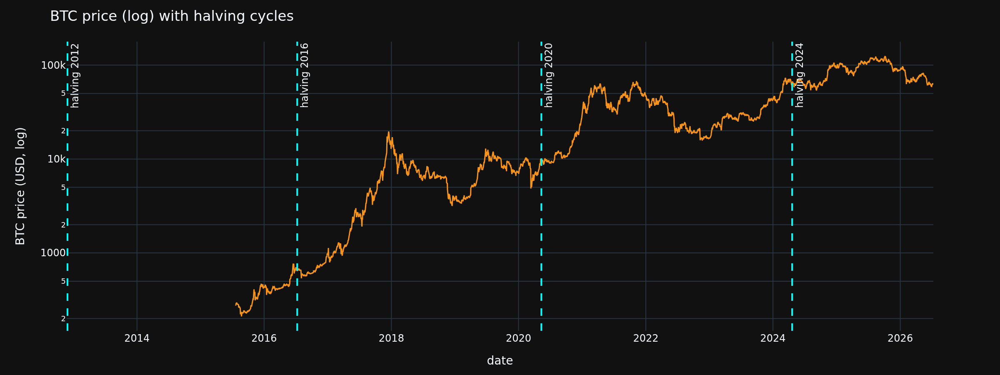
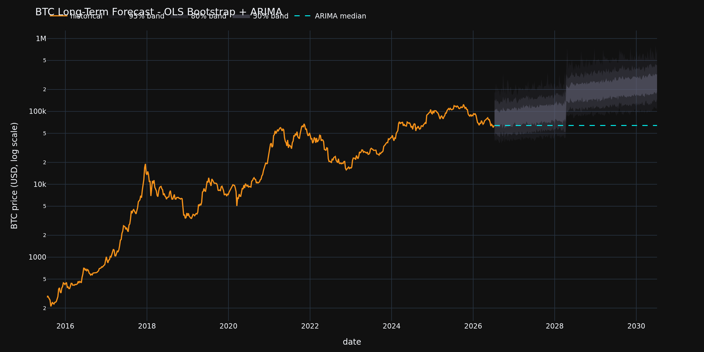
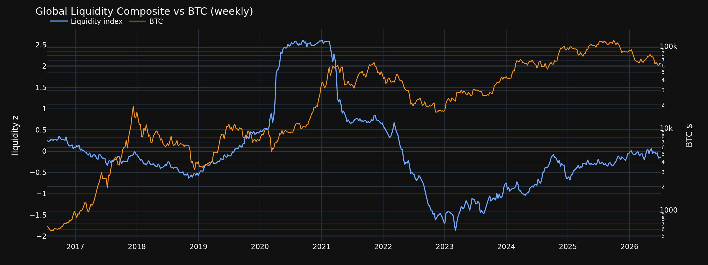
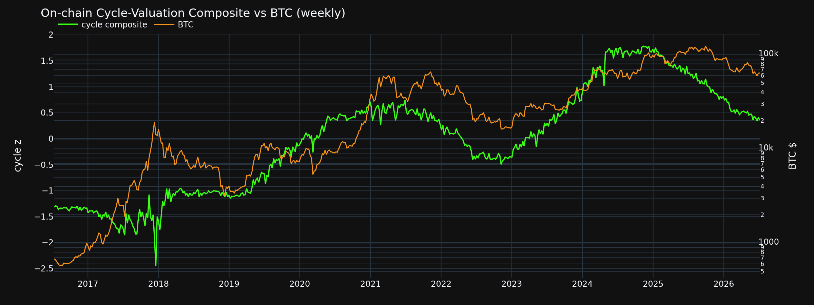

# ccquant

Lightweight crypto market data and forecasting research toolkit.

The first goal is reproducible OHLCV collection into a local DuckDB database.
Forecasting code can then read the same tables for short-term and long-term
statistical, ML, and foundation-model experiments.

## Quickstart

```bash
# Default local install — lint/test (pre-commit) + ipykernel + Jupyter/plotly +
# forecast libs (`dependency-groups.dev` is on by default)
uv sync
uv run python -m ipykernel install --user --name=ccquant --display-name="Python (ccquant)"
uv run pre-commit install

# Full local install (all extras + dependency groups)
uv sync --all-extras --all-groups

# Or pick tiers explicitly:
# CLI + tests + notebooks (same notebook packages as default `uv sync`)
uv sync --extra dev

# + forecasting libs (also in default dependency-groups.dev now)
uv sync --extra dev --extra forecast

# Full pipeline incl. dbt + wallet/BigQuery
uv sync --extra dev --extra forecast --extra dbt --extra wallet

uv run ccquant sync all                     # universe + OHLCV + OI + depth + MEV + macro + wallets + dbt
uv run ccquant sync universe --size 100
uv run ccquant sync backfill --interval 1d
# If history looks too short (e.g. after a geo-blocked Binance run marked complete):
# uv run ccquant sync backfill --interval 1d --force --top 50
uv run ccquant sync backfill --interval 1h --top 10
uv run ccquant status
```

**Notebooks in VS Code / Cursor:** after `uv sync`, select the project interpreter
(`.venv/bin/python`) or the **Python (ccquant)** kernel when opening any `.ipynb`.
Missing `ipykernel` usually means the env was created with `uv sync --no-dev` or
the wrong interpreter is selected.

Alternatively launch JupyterLab:

```bash
uv run jupyter lab notebooks/
```

### Wallet intelligence (Solana + Arbitrum + Bitcoin)

```bash
uv run ccquant sync wallets --no-tail
uv run ccquant wallet import-extract --source bigquery --chain bitcoin
uv run ccquant wallet discover --chain bitcoin --top 20
uv run dbt build --select fct_btc_* fct_wallet_* mart_signals_daily --project-dir dbt --profiles-dir dbt
```

By default, data is stored at `data/ccquant.duckdb`. Override it with:

```bash
export CCQUANT_DB=data/research.duckdb
```

## Data Model

Primary tables:

- `assets`: active research universe with CoinGecko IDs and exchange pairs.
- `ohlcv_daily`: daily OHLCV candles by `symbol`, `date`, and `source`.
- `ohlcv_hourly`: hourly OHLCV candles by `symbol`, `hour`, and `source`.
- `sync_state`: per-symbol sync metadata.

Sources are tried in this order: Binance, Coinbase, then CoinGecko fallback.

## Export

```bash
uv run ccquant export parquet --out data/export
uv run ccquant export csv --out data/export
```

These exports are intended as stable inputs for notebooks, model training, and
external forecast pipelines.

## Strategy research

Walk-forward, cost-aware strategy templates. For a **multi-year** momentum test,
force a full daily backfill first (short panels are not multi-year):

```bash
uv run ccquant sync backfill --interval 1d --full --force --top 50
uv run dbt run --select fct_ohlcv_daily --full-refresh --project-dir dbt --profiles-dir dbt
uv run ccquant research run --strategy cs_mom_simple
uv run ccquant research run --strategy btc_macro_ls   # BTC-only macro long/short
```

See [`documentation/strategy_research.md`](documentation/strategy_research.md) and
`notebooks/Strategy_Template.ipynb`.

## Forecasting Direction

Keep data ingestion deterministic and boring. Add models in layers:

1. Statistical baselines: naive, moving average, ARIMA/SARIMAX, volatility models.
2. ML features: lagged returns, rolling volatility, volume features, cross-asset ranks.
3. Foundation models: convert OHLCV panels into documented time-series prompts or
   dataset artifacts without coupling them to the ingestion code.

## Notebooks

Research notebooks in `notebooks/` — each runs top-to-bottom, loads `.env`
for API keys, and degrades gracefully to synthetic data when keys are absent.

```bash
uv sync                                    # default: includes ipykernel + Jupyter/plotly + forecast libs
uv run python -m ipykernel install --user --name=ccquant --display-name="Python (ccquant)"
# or: uv sync --all-extras --all-groups
```

In **VS Code / Cursor**: open the `.ipynb` → kernel picker → choose
`.venv` / **Python (ccquant)**. In a terminal: `uv run jupyter lab notebooks/`.

### Market Tracker (`Market_Tracker.ipynb` + HTML dashboard)

Fast research surface for **where the market is** (BTC snapshot, universe
breadth, OI, macro/on-chain regime labels, sync freshness) and **where regimes
suggest it may go** (stacked score + historical BTC forward returns in similar
stacks + rule-based outlook). Reads `mart_signals_daily` / `fct_ohlcv_daily` via
forecasting loaders; deep forecast fans stay in `BTC.ipynb` / `Macro.ipynb` /
`OnChain_BTC.ipynb`. Degrades with `[MISSING]` when domains are empty.

Single-page UI (no server) — brand, headline, key metrics, one BTC chart,
regime strip, outlook:

```bash
uv run ccquant sync onchain               # blockchain.info fundamentals (+ BID if keyed)
uv run ccquant sync etf                   # Farside US spot BTC ETF flows + Yahoo MSTR
uv run dbt build --select fct_onchain_signals+ --project-dir dbt --profiles-dir dbt
uv run ccquant dashboard                  # writes data/export/market_tracker.html + opens
uv run ccquant dashboard --no-open --out data/export/market_tracker.html
```

Dashboard chips include on-chain regime plus an **ETF/MSTR demand** health
indicator (7d Farside net flow + MSTR vs BTC 20d relative strength). Renew
`BITCOIN_IS_DATA_KEY` for full MVRV/NUPL history (subscription currently required).

### BTC Long-Term Price Forecast (`BTC.ipynb`)

Cointegrating OLS (log BTC ~ time + M2 + hashrate + halving cycle) with HAC
standard errors, ARIMA cross-check, and conformal-calibrated bootstrap intervals
at 1y / 2y / 4y horizons.

<p align="center">
  
</p>

<p align="center"><em>BTC price on a log scale with halving events marked. The ~4-year supply-shock cycle is the structural feature the model exploits.</em></p>

<p align="center">
  
</p>

<p align="center"><em>Calibrated bootstrap forecast fan (50% / 80% / 95% bands) with ARIMA median cross-check. Intervals are conformal-rescaled to achieve empirical coverage.</em></p>

### ETH Long-Term Value & Price Research (`Eth.ipynb`)

Long-horizon Ether analysis combining FRED liquidity regimes, notebook-local ETH
on-chain activity (fees, TVL, staking, net issuance), an exploratory
**stock-to-flow** frame (supply / annualized net issuance post-Merge), a protocol
**fee/burn DCF** fair-value band, early-signal lead/lag + Probit, and calibrated
OLS bootstrap forecasts at 1y / 2y / 4y. Degrades to synthetic on-chain/macro
series when API keys are absent.

### DeFi Aggregate — Multi-Chain Activity (`DEFI.ipynb`)

Cross-chain DeFi dashboard from keyless DefiLlama (global + per-chain TVL, DEX
volume, fees), weekly activity-composite regimes, curated legislation/shock
overlays from `dbt/seeds/events.csv`, and a rule-based outlook snapshot. Includes
a crypto-native Trump panel ($TRUMP / WLFI via CoinGecko, DefiLlama protocol
probe, public TRUMP mint seed) — DJT equity out of scope. Degrades to synthetic
aggregates when network/API data is unavailable.

### Macro Trend-Change Signals (`Macro.ipynb`)

Predicts monetary-policy / liquidity regime changes. Builds a Global Liquidity
Index from FRED series (M2, Fed balance sheet, real rates, DXY, VIX), detects
regime turning points, and backtests forward BTC returns conditional on regime.

<p align="center">
  
</p>

<p align="center"><em>Global Liquidity Composite (z-scored M2 growth + Fed BS growth &minus; real rate change) vs BTC price. Crypto is a high-beta claim on liquidity.</em></p>

### Strategy Template — Multi-Year Momentum (`Strategy_Template.ipynb`)

Walk-forward CS long/short (`cs_mom_simple` by default) on the daily OHLCV panel:
PIT features, costs/capacity, purged multi-year folds, scale gates.
See [`documentation/strategy_research.md`](documentation/strategy_research.md).

### On-Chain BTC Direction Signals (`OnChain_BTC.ipynb`)

Predicts BTC price-direction regimes from on-chain fundamentals: hashrate,
miner profitability (hashprice, Puell Multiple), holder P&L (MVRV, SOPR, NUPL),
and network activity. Uses keyless blockchain.info data plus optional
bitcoinisdata.com / Glassnode for valuation metrics.

<p align="center">
  
</p>

<p align="center"><em>On-chain cycle-valuation composite (z(MVRV) + z(SOPR) + z(NUPL) + z(RHODL) &minus; z(Puell)) vs BTC price. Low = cheap/capitulation; high = expensive/distribution.</em></p>

> Charts are static snapshots rendered by `scripts/render_chart_images.py`.
> Run the notebooks interactively for full hover tooltips, range sliders, and
> live data. See [`documentation/API_Pricing.md`](documentation/API_Pricing.md)
> for data source setup and API key configuration.
